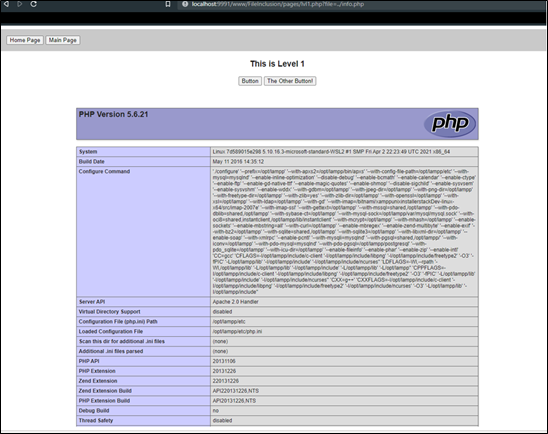

# **Bezpieczeństwo Systemów Informatycznych**
## Raport Bezpieczeństwa
* *Data wykonania raportu: 20.01.2022* 
* *Wersja Raportu 1.0*

***

Aplikacja  *Vulnerable Web Application*. Strona zostałą przygotowana jako przykład wrażliwej aplikacji, podatnej na różnego typu ataki.

------

***
### 1. **Podsumowanie**
Audyt bezpieczeństwa webowej plikacji *Vulnerable Web Application* został przeprowadzony w celu weryfikacje ze standardem *Application Security Verification Standard (ASVS)* w wersji 4.0 pod kątem ogólnego bezpiezeństwa aplikacji. BAdana apliakcja została stworzona z myślą o wskazaniu wszekiego rodzoaju podatności więć jej ogólna zogodność ze standardem jest niewielka.

Czynniki mające wpływ na brak zgodności z wymogami to przedewszytkim:
>- Brak kontroli przesłanych przez użytkownika plików
>- Podatność na cross site scripting (XSS)
>- Podatność na atakm takie jak np SQL Injection 
>- Ponadto, w systemie zostało zidentyfikowanych kilka podatności o mniejszym poziomie istotności, które jednak też mogą w pewien sposób ułatwiać napastnikom przejęcie kontroli nad systemem

***

### 2. **Zakres i Cele audytu**

#### 2.1 **Cele i metodologia audytu**

**Celem audytu była weryfukacja spełanienia przez aplikację standardu bezpieczeństwa ASVS 4.0 na poziomie 2.** 
***

#### 2.2 **Zakres audytu:**
>**Audyt Objął Następujące obszary:**
>+ Architektura Aplikacji
>+ Modelowanie zagrożeń
>+ Metody uwierzytelniania
>+ Metody kontroli dostępu 
>+ Zarządzanie sesją 
>+ Metody walidacji i czyszczenia danych wejściowych
>+ Obsługa błędów 
>+ Obłusługa danych 
>+ Bezpieczeństwo logiki biznesowej 
>+ Bezpieczeństwo plików 
>+ Konfiguracje 

### 3. **Aplikacja** 
>+ **Nazwa:** *Vulnerable Web Application*
>+ **Technologia aplikacji:** *Apache 2.4.18, PHP 5.6.21*
>+ **Back-end:** *MySql 5.0*
>+ **Repozytorium:** *[Link to Repository](https://github.com/OWASP/Vulnerable-Web-Application)*

***
**Opis:**

**Vulnerable-Web-Application** to strona, która jest przygotowana dla osób, które interesują się testami penetracyjnymi i chcą mieć informacje na ten temat lub pracować. Strona jest dość prosta w instalacji i użytkowaniu.

Vulnerable-Web-Application obejmuje Command Execution, File Inclusion, File Upload, SQL oraz XSS. Dla kategorii wymagających bazy danych, tworzy bazę danych pod localhost za pomocą jednego przycisku podczas konfiguracji. W przypadku uszkodzonych lub zmienionych baz danych, można utworzyć bazę danych ponownie.

**Licancja:** Aplikacja jest licencjonowana na zasadach GNU General Public License v3.0.

___

### 4. **Klasyfikacja podatności**

Na liście poniżej przedstawiono skrótowy opis każdej z podatności. Każdy błąd został oznaczony kolorem, zgodnie z legendą:

  

>+ **Niskie Zagrożenie: –** *wykorzystanie podatności ma niewielki bezpośredni wpływ na bezpieczeństwo aplikacji lub wymaga bardzo trudnych warunków do spełnienia (np. fizyczny dostęp do serwera).*

>+ **Średnie zagrożenie  –** *wykorzystanie podatności może zależeć od zewnętrznych czynników (np. wymaga przekonania użytkownika do kliknięcia w łącze) lub może wymagać trudnych do spełnienia warunków. Ponadto wykorzystanie podatności zazwyczaj umożliwia dostęp tylko do ograniczonej ilości danych lub do danych o mniejszym poziomie istotności.*

>+ **Wysokie zagrożenie  –** *wykorzystanie podatności umożliwia przejęcie pełnej kontroli nad serwerem lub urządzeniem sieciowym albo pozwala uzyskać dostęp (w trybie zapisu i/lub odczytu) do danych o dużym poziomie poufności i istotności. Wykorzystanie podatności pozwala także na uzyskanie dostępu do wrażliwych informacji, może wcześniej wymagać spełnienia pewnych warunków (np. posiadania konta użytkownika w wewnętrznym systemie).*

___

### 5. **Lista odnalezionych podatności - szczegóły**

Niniejszy raport jest podsumowaniem testów bezpieczeństwa przeprowadzonych w celu wykrycia ewentualnych luk w oprogramowaniu. Przedmiotem  sprawdzenia była aplikacja webowa *Vulnerable Web Application*.

W trakcie audytu szczególny nacisk położono na podatności mające lub mogące mieć negatywny wpływ na poufność, integralność oraz dostępność przetwarzanych danych. Testy bezpieczeństwa przeprowadzono zgodnie z powszechnie przyjętymi metodykami testowania aplikacji webowych, takimi jak: **OWASP TOP10**

#### A. **Podatności XSS (Cross-Site Scripting)**

---
Na czym polega istota podatności XSS? Po pierwsze jest to przede wszystkim atak na klienta korzystającego z podatnej webaplikacji (w przeciwieństwie np. do SQL injection, którego głównym celem jest część serwerowa).

Po drugie, atak polega na wstrzyknięciu do przeglądarki ofiary fragmentu javascript który może być uruchomiony w przeglądarce.

  W efekcie, atakujący ma możliwość wykonania dowolnego kodu skryptowego w przeglądarce 

**Poziom ryzyka:**

  
    

  Liczne wystąpienia, m.in. nazwa użytkownika w historii logowania, nazwy produktów itp. Brak lub dowolne konto w systemie (w zależności od konkretnego wystąpienia).

  
    

  
    

    

  
    
  
    

  
    
   
    

  
    
   
    

  
    
    
    

  
    

___

**Rekomendacja:**
    Filtrowanie wprowadzanych danych oraz sprawdzenie znaków potencjalnie niebezpiecznych. Zmiana znaków zpecjalnych na encje.

#### B. **Podatności Sql Injection**
___
  W aplikacji zidentyfikowano błędy SQL Injection, pozwalające napastnikom na pełny dostęp do bazy danych danej instancji. Użytkownik może poznać zawartość bazy ale również modyfikować. W konsekwencji wykorzystania tej podatności możliwy jest: 
  >1. Dostęp do hashy haseł użytkowników systemu
  >2. Dostęp do danych wszystkich kontrahentów
  >3. Dostęp do treści maili.
___
**Poziom Ryzyka:**

  
    

  W aplikacji zidentyfikowano błędy SQL Injection, pozwalające napastnikom na pełny dostęp do bazy danych danej 
  instancji W konsekwencji wykorzystania tej podatności możliwy jest:

  Widoczna informacja na temat  bazy danych oraz znajdujących się w niej tabel.

  
    

    

  
    

    

  
    

    

  
    
    
    

  
    

___
**Rekomendacja:**
    Każda operacja na bazie danych powinna być wykonywana ze szczególna ostrożnością. Propozycje obrony przd SQL Injection:
  > - Używanie spreparowanych instrukcji  
  > - Używanie procedur przechowywanych
  > - Filtorwanie danych użytkownika
  > - Sprawdzanie danych wejściowych z listą dozwolych wyrażeń

#### C. **File inclusion vulnerability**
___

Typ ataku często dotyczy aplikacji webowych, które opierają się na skryptach i pojawiają się, gdy aplikacja webowa pozwala użytkownikom na wprowadzanie danych do plików lub wysyłanie plików na serwer.

File inclusion vulnerability zielą się na dwa typy, w zależności od pochodzenia dołączanego pliku:
>+ Lokalne dołączanie plików (LFI)
>+ Zdalne dołączanie plików (LFI)
___

**Poziom Ryzyka:**

  
    

  
    

  

  
    

  
    

___

**Rekomendacja:**
    Aby zminimalizować ryzyko ataków RFI, należy wdrożyć odpowiednią walidację i sanityzację danych wejściowych. 

#### D. **File Uploads**
___

**Poziom Ryzyka:**

Użytkownik w Search Barzu może zauplodować plik o dowolnym formacie. Nie ma weryfikacji wprowadzanego uploadowanego pliku. 

  
    

  
    

  

  

___

**Rekomendacja:**
    Należy wprowadzić weryfikację uplaudowanych plików. Użytkownik powienin mieć możliwość wgrania pliku jedynie o danym formacie oraz rozmiarze.

___

### 6. **Wnioski z testów**

W aplikacji zidentyfikowano kilka sposobów na wykonywanie dowolnego kodu po stronie serwera. Praktycznie tego typu podatność może zostać wykorzystana m.in. do:

>+ Przejęcia wszystkich danych przechodzących przez system. Mogą to być zarówno dane użytkowników systemu (loginy i hasła), jak i dane przetwarzane przez system, takie jak: listy kontrahentów, dane osobowe itp
>+ Dalszych ataków na inne hosty znajdujące się w sieci wewnętrznej

Zwraca również uwagę duża liczba podatności typu Cross-Site Scripting (XSS), które mogą zostać wykorzystane do wstrzyknięcia niepożądanego kodu. 

Mechanizm importowania plików dostępny dla wszystkich użytkowników systemu w niewystarczający sposób waliduje poprawność wysyłanych plików, pozwalając tym samym na wgranie pliku PHP do dowolnego katalogu serwera.

Ponadto, w systemie zostało zidentyfikowanych kilka podatności o mniejszym poziomie istotności, które jednak też mogą w pewien sposób ułatwiać napastnikom przejęcie kontroli nad systemem. 

Wszystkie problemy zostały szczegółowo opisane w niniejszym raporcie.